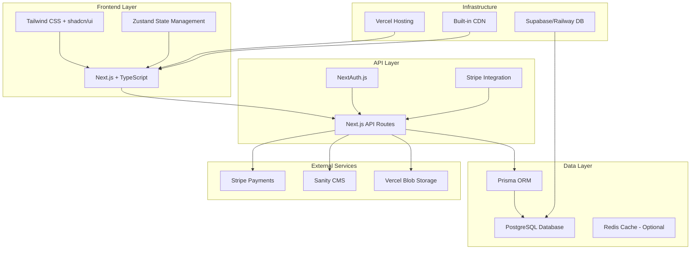

# Rustic Roots E-Commerce Technology Stack Evaluation

**Project**: Rustic Roots - Custom Wood Furniture E-commerce Platform  
**Phase**: MVP/Startup  
**Requirements**: AI-generated, strongly typed, minimal maintenance  
**Date**: 2025-06-17  

## Executive Summary

This document provides a comprehensive technology stack evaluation for Rustic Roots, focusing on rapid MVP development with strong typing, minimal maintenance, and AI-assisted code generation. The recommended stack centers around **Next.js 14+ with TypeScript** for a unified full-stack approach.

## 🎯 Recommended Technology Stack

### Frontend Architecture

#### **Next.js 14+ with TypeScript**
- **Framework**: Next.js (React-based, full-stack capabilities)
- **Language**: TypeScript (strongly typed, excellent IDE support)
- **Styling**: Tailwind CSS + shadcn/ui components
- **State Management**: Zustand (lightweight, TypeScript-first)

**Pros:**
- ✅ Strongly typed throughout the application
- ✅ Excellent SEO with Server-Side Rendering (SSR) and Static Site Generation (SSG)
- ✅ Built-in API routes (reduces backend complexity)
- ✅ Automatic code splitting and optimization
- ✅ Vercel deployment integration (zero-config)
- ✅ Large community and extensive documentation
- ✅ Perfect for AI code generation

**Cons:**
- ❌ React learning curve (mitigated by AI generation)
- ❌ Can be overkill for simple sites (but perfect for e-commerce)

**Development Effort**: Medium (AI-assisted: Low)  
**Maintenance**: Low (automatic updates, strong typing prevents bugs)

### Backend Architecture

#### **Next.js API Routes + Prisma ORM**
- **Runtime**: Node.js (via Next.js)
- **Database ORM**: Prisma (TypeScript-first, type-safe queries)
- **API Architecture**: REST (simpler than GraphQL for MVP)
- **Authentication**: NextAuth.js (built-in providers)

**Pros:**
- ✅ Single codebase (frontend + backend)
- ✅ Type-safe database queries
- ✅ Automatic database migrations
- ✅ Built-in authentication patterns
- ✅ Excellent TypeScript integration
- ✅ Shared types between frontend and backend

**Cons:**
- ❌ Vendor lock-in to Node.js ecosystem
- ❌ Less separation of concerns than microservices

**Development Effort**: Low (unified stack)  
**Maintenance**: Very Low (single deployment, shared types)

### Database Strategy

#### **PostgreSQL + Prisma**
- **Primary Database**: PostgreSQL (on Supabase or Railway)
- **ORM**: Prisma (type-safe, migration management)
- **Caching**: Built-in Next.js caching + Redis (optional for scaling)

**Pros:**
- ✅ ACID compliance for e-commerce transactions
- ✅ Excellent performance for complex queries
- ✅ Strong typing with Prisma
- ✅ Managed hosting options available
- ✅ Full-text search capabilities
- ✅ Excellent scalability

**Cons:**
- ❌ More complex than NoSQL for simple data
- ❌ Requires migration management

**Development Effort**: Low (Prisma handles complexity)  
**Maintenance**: Low (managed hosting + automated backups)

### Search & Filtering

#### **Database-First Approach**
- **Primary**: PostgreSQL full-text search + indexed queries
- **Enhancement**: Algolia (if advanced search needed later)

**Pros:**
- ✅ No additional infrastructure for MVP
- ✅ Strongly typed search queries
- ✅ Cost-effective for startup phase
- ✅ Easy to implement with Prisma
- ✅ Sufficient for most e-commerce filtering needs

**Cons:**
- ❌ Limited advanced search features
- ❌ May need upgrade for complex filtering

**Development Effort**: Low  
**Maintenance**: Very Low

### Infrastructure & Deployment

#### **Vercel + Managed Services**
- **Hosting**: Vercel (Next.js optimized)
- **Database**: Supabase or Railway PostgreSQL
- **File Storage**: Vercel Blob or Cloudinary
- **CDN**: Built-in with Vercel
- **CI/CD**: Vercel Git integration

**Pros:**
- ✅ Zero-config deployment
- ✅ Automatic scaling
- ✅ Built-in CDN and edge functions
- ✅ Excellent developer experience
- ✅ Generous free tiers
- ✅ Global edge network

**Cons:**
- ❌ Vendor lock-in
- ❌ Can become expensive at scale

**Development Effort**: Very Low  
**Maintenance**: Minimal (managed services)

### Payments & Security

#### **Stripe + NextAuth.js**
- **Payment Gateway**: Stripe (TypeScript SDK)
- **Authentication**: NextAuth.js + JWT
- **SSL**: Automatic with Vercel
- **Security**: Built-in Next.js security headers

**Pros:**
- ✅ Industry-standard payment processing
- ✅ Strong TypeScript support
- ✅ Built-in security best practices
- ✅ Comprehensive documentation
- ✅ PCI compliance handled by Stripe

**Cons:**
- ❌ Transaction fees (2.9% + 30¢)
- ❌ Compliance requirements

**Development Effort**: Medium (AI-assisted: Low)  
**Maintenance**: Low (managed service)

### Content Management

#### **Headless CMS Approach**
- **CMS**: Sanity.io or Contentful
- **Integration**: TypeScript SDK + code generation
- **Alternative**: Database-based with admin panel

**Pros:**
- ✅ Non-technical content editing
- ✅ Strong TypeScript integration
- ✅ Version control for content
- ✅ API-first approach
- ✅ Excellent developer experience

**Cons:**
- ❌ Additional service dependency
- ❌ Learning curve for content editors

**Development Effort**: Medium  
**Maintenance**: Low

## 🏗️ System Architecture



## 📋 Implementation Roadmap

### Phase 1: Foundation Setup (Week 1-2)

#### **Project Initialization**
- Create Next.js project with TypeScript configuration
- Configure Tailwind CSS + shadcn/ui component library
- Set up Prisma with PostgreSQL connection
- Configure Vercel deployment pipeline
- Set up development environment and tooling

#### **Core Database Schema**
```typescript
// Core entities
- Products (with variants, images, inventory tracking)
- Categories (hierarchical structure)
- Users (customers and admin roles)
- Orders (with line items and status tracking)
- Reviews (product feedback system)
```

#### **Basic Authentication**
- NextAuth.js configuration
- User registration and login flows
- Protected route middleware
- Role-based access control

### Phase 2: Core E-commerce Features (Week 3-4)

#### **Product Catalog**
- Product listing with server-side filtering
- Product detail pages with image galleries
- Category navigation and breadcrumbs
- Search functionality with PostgreSQL full-text search
- Inventory management system

#### **Shopping Cart & Checkout**
- Persistent shopping cart (localStorage + database sync)
- Cart management (add, remove, update quantities)
- Multi-step checkout process
- Address management and validation
- Tax calculation and shipping options

#### **Payment Integration**
- Stripe payment processing
- Order creation and management
- Payment confirmation and receipts
- Email notifications for order status

### Phase 3: Admin & Content Management (Week 5-6)

#### **Admin Dashboard**
- Product management interface
- Order processing and fulfillment
- Customer management
- Inventory tracking and alerts
- Sales analytics and reporting

#### **Content Management**
- CMS integration for static pages
- Blog/help center functionality
- SEO optimization tools
- Meta tag management
- Sitemap generation

### Phase 4: Optimization & Launch (Week 7-8)

#### **Performance Optimization**
- Image optimization and lazy loading
- Caching strategies implementation
- Core Web Vitals optimization
- Database query optimization
- Bundle size optimization

#### **Quality Assurance**
- Automated testing setup (Jest + Testing Library)
- End-to-end testing (Playwright)
- Security audit and penetration testing
- Performance testing and monitoring
- Accessibility compliance (WCAG 2.1)

#### **Launch Preparation**
- Custom domain configuration
- Analytics integration (Google Analytics 4)
- Error monitoring (Sentry)
- Performance monitoring (Vercel Analytics)
- Backup and disaster recovery procedures

## 💰 Cost Analysis

### MVP Phase (0-1,000 orders/month)
- **Vercel Pro**: $20/month
- **Supabase Pro**: $25/month
- **Sanity CMS**: $15/month
- **Stripe Processing**: ~2.9% + 30¢ per transaction
- **Domain & SSL**: $15/year
- **Total Fixed Costs**: ~$60/month + transaction fees

### Growth Phase (1,000-10,000 orders/month)
- **Infrastructure Scaling**: $100-300/month
- **Additional Services**: $50-100/month
- **Enhanced Support**: $50/month
- **Total Costs**: $200-450/month + transaction fees

### Enterprise Phase (10,000+ orders/month)
- **Custom Infrastructure**: $500-1,500/month
- **Dedicated Support**: $200-500/month
- **Advanced Features**: $100-300/month
- **Total Costs**: $800-2,300/month + transaction fees

## 🔧 Development & Maintenance Strategy

### AI-First Development Approach
- **Code Generation**: Leverage AI for boilerplate and repetitive code
- **Type Safety**: Use TypeScript throughout for compile-time error detection
- **Testing**: Implement comprehensive automated testing suite
- **Documentation**: Maintain up-to-date technical documentation
- **Code Reviews**: Automated code quality checks and reviews

### Minimal Maintenance Philosophy
- **Managed Services**: Rely on managed infrastructure and services
- **Automatic Updates**: Configure automatic dependency updates with testing
- **Monitoring**: Comprehensive application and infrastructure monitoring
- **Alerting**: Proactive alerting for issues and performance degradation
- **Backup**: Automated backup and disaster recovery procedures

### Scalability Roadmap
1. **Database Optimization**: Query optimization and proper indexing
2. **Caching Layer**: Implement Redis for session and data caching
3. **CDN Enhancement**: Advanced CDN configuration for global performance
4. **Microservices**: Extract specific services if needed for scale
5. **Advanced Search**: Migrate to Elasticsearch or Algolia for complex search

## 🚀 Next Steps

1. **Environment Setup**: Initialize development environment with recommended stack
2. **Database Design**: Create detailed database schema and relationships
3. **UI/UX Design**: Design system and component library setup
4. **Core Implementation**: Begin with authentication and product catalog
5. **Iterative Development**: Implement features in priority order with regular testing

## 📊 Success Metrics

### Technical Metrics
- **Performance**: Core Web Vitals scores > 90
- **Uptime**: 99.9% availability target
- **Security**: Zero critical security vulnerabilities
- **Type Safety**: 100% TypeScript coverage
- **Test Coverage**: > 80% code coverage

### Business Metrics
- **Time to Market**: MVP launch within 8 weeks
- **Development Cost**: Stay within budget constraints
- **Maintenance Overhead**: < 5 hours/week post-launch
- **Scalability**: Handle 10x traffic growth without major refactoring
- **User Experience**: Page load times < 2 seconds

---

**Document Version**: 1.0  
**Last Updated**: 2025-06-17  
**Next Review**: 2025-07-01